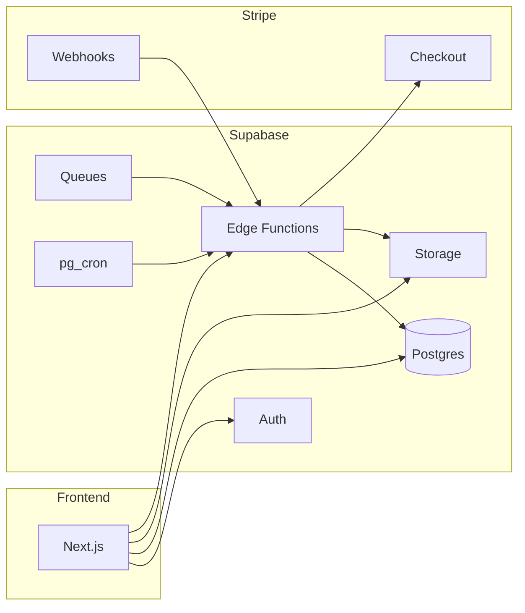

# Backend Development Plan

## Overview

Backend is **Supabase only**: Postgres, Auth, Storage, Edge Functions, and Queues/pg_cron. No separate API server. Bank statement converter: MT940/CAMT.053 → CSV/XLSX/QBO. **Stripe** handles coin top-ups and Pro subscription.

---

## Architecture



- **Frontend** uses Supabase JS client (Auth, Postgres, Storage) and invokes Edge Functions for upload init, job creation, export download, and Stripe checkout.
- **Auth**: Supabase Auth (email, OAuth). No Auth0.
- **Data**: Supabase Postgres (`jobs`, `profiles`, optional `pricing_packages`), RLS for tenant isolation.
- **Files**: Supabase Storage buckets `raw` and `exports`; signed URLs from Edge Functions.
- **Logic**: Edge Functions (Deno): uploads-init, jobs-create, process-job, exports-download, stripe-checkout, stripe-webhook.
- **Stripe**: Checkout for coin packs and Pro subscription; webhook Edge Function updates `profiles` (balance, subscription_status).

---

## Local development (Supabase CLI)

Use the **Supabase CLI** for local development (no separate Docker Compose for day-to-day dev).

- **Setup**: Install [Supabase CLI](https://supabase.com/docs/guides/cli); from repo root run `supabase init` (if not already done), then `supabase start` to run Postgres, Auth, Storage, etc. locally.
- **Local URL and keys**: Run `supabase status` and use the printed **API URL** and **anon key** (and **service_role key** for Edge Functions later). Set these in frontend `.env.local` as `NEXT_PUBLIC_SUPABASE_URL` and `NEXT_PUBLIC_SUPABASE_ANON_KEY`.
- **Migrations**: `supabase db reset` or `supabase migration up` applies `supabase/migrations/*.sql`.
- **Edge Functions** (later): `supabase functions serve` runs functions locally against local Supabase.
- **Production**: Create a hosted project at [supabase.com](https://supabase.com), run `supabase link`, then `supabase db push` and `supabase functions deploy`; point env to hosted URL and keys.
- **Email verification (code)**: Signup uses "enter code from email". In Supabase Dashboard → Authentication → Email Templates → **Confirm signup**, add the 6-digit OTP to the body (e.g. `Your verification code is: {{ .Token }}`) so users can enter it on the verify-email page. Local dev: emails are in [Inbucket](http://localhost:54324).

---

## Phase 1: Supabase Foundation (Days 1–2)

### 1.1 Project

- [ ] Create Supabase project (dashboard or `supabase init`); link via CLI with `supabase link`. For **local dev** use `supabase start` (no separate Docker Compose); for **production** use a hosted project and `supabase link`.

### 1.2 Schema (Postgres)

- [ ] **jobs**: id (uuid), user_id (uuid, references auth.users), status (text), format (text), raw_key (text), file_name (text), created_at, updated_at, completed_at (timestamptz nullable), validation_errors (jsonb), validation_warnings (jsonb). Align with frontend `Job` and `ValidationReport` in `frontend/src/lib/api-types.ts`.
- [ ] **profiles**: id (uuid, references auth.users), name (text), email (text), balance (int, coins), subscription_status (text: 'free' | 'pro' | 'none'), stripe_customer_id (text nullable), stripe_subscription_id (text nullable), created_at, updated_at. Create row on sign-up (trigger or Edge Function).
- [ ] **pricing_packages** (optional): id, name, coins, price_cents, stripe_price_id, popular (boolean). Or fetch from Stripe at runtime.

### 1.3 RLS

- [ ] Enable RLS on `jobs` and `profiles`.
- [ ] Policies: user can read/write only own rows (`auth.uid() = user_id` for jobs, `auth.uid() = id` for profiles). Edge Functions use service role where needed.

### 1.4 Storage

- [ ] Buckets: `raw` (uploaded statements), `exports` (generated files). Access via service role in Edge Functions; signed URLs for client upload/download.

### 1.5 Migrations

- [ ] All schema and RLS in `supabase/migrations/` (SQL). No TypeORM.

---

## Phase 2: Auth (Days 3–4)

### 2.1 Supabase Auth

- [ ] Email/password and/or OAuth (Google, GitHub). Configure in Supabase Dashboard.

### 2.2 Profile

- [ ] On first sign-in, ensure a `profiles` row (DB trigger on `auth.users` insert or Edge Function from frontend).
- [ ] `/me` equivalent: frontend reads `profiles` + `auth.getUser()`, or an RPC that returns current user + profile.

### 2.3 Permissions

- [ ] Replace API scopes with RLS. Pro-only features: check `profiles.subscription_status` in app or RLS.

---

## Phase 3: Upload Pipeline (Days 5–6)

### 3.1 Edge Function `uploads-init`

- [ ] Invoked with `{ filename, contentType }`. Returns `{ uploadId, presignedUrl }` (or `{ uploadUrl, key }`) to match `UploadInitResponse` in `frontend/src/lib/api-types.ts`.
- [ ] Use Supabase Storage API to create signed upload URL for bucket `raw`, 15 min expiry. Key = path e.g. `{user_id}/{uuid}-{filename}`.

### 3.2 Frontend flow

- [ ] Frontend uploads file to presigned URL; then calls `jobs-create` with `{ key }`.

### 3.3 Edge Function `jobs-create`

- [ ] Insert row in `jobs` (user_id from auth, status pending, raw_key, file_name). Enqueue job id to **Supabase Queues** or invoke **process-job** via HTTP.
- [ ] Return `{ jobId, status }` (`CreateJobResponse`).

### 3.4 Jobs list/get

- [ ] Via Supabase client: `supabase.from('jobs').select().order('created_at', { ascending: false })` and `.select().eq('id', jobId).single()`. RLS enforces ownership. No dedicated Edge Function required.

---

## Phase 4: Job Worker and Parsers (Days 7–10)

### 4.1 Edge Function `process-job`

- [ ] Triggered by Supabase Queues (consumer) or pg_cron HTTP. Load job by id; download file from `raw` using `raw_key`; detect format (MT940 vs CAMT.053); run parser; update job (status, format, validation_errors, validation_warnings); generate CSV/XLSX/QBO; upload to `exports` bucket; set job status completed and store export keys if needed.

### 4.2 Parsers

- [ ] Implement in Deno/TS inside Edge Function (or shared import). **CAMT.053**: XML parser (e.g. fast-xml-parser or Deno-compatible lib). **MT940**: tag parsing (`:20:`, `:25:`, `:28C:`, `:60F/M`, `:61:`, `:86:`, `:62F/M`). Output: normalized `Transaction[]`. Use npm/Deno imports per [Supabase Edge Functions dependencies](https://supabase.com/docs/guides/functions/dependencies).

### 4.3 Exporters

- [ ] CSV (manual or lib), XLSX (e.g. [SheetJS Deno CDN](https://docs.sheetjs.com/docs/getting-started/installation/deno)), QBO (IIF or XML). Write to temp then upload to `exports` bucket.

### 4.4 Format auto-detection

- [ ] Detect MT940 vs CAMT.053 from content; store format in job record.

---

## Phase 5: Exports Download (Day 11)

### 5.1 Edge Function `exports-download`

- [ ] Invoked with `jobId`, `format` (csv | xlsx | qbo). Verify job ownership (query by auth.uid()); return signed download URL for object in `exports` bucket (e.g. 5 min expiry). Frontend redirects or opens URL.

---

## Phase 6: Security and Retention (Days 12–13)

### 6.1 Security

- [ ] CORS configured on Edge Functions; no secrets in client; rate limiting via Supabase or reverse proxy if self-hosted.

### 6.2 Retention

- [ ] **pg_cron** (Supabase): schedule (e.g. daily 03:00) that calls an Edge Function or SQL to delete objects in `raw` and `exports` older than `RETENTION_HOURS` (e.g. 72) and optionally clean old `jobs` rows. Config via Supabase secrets.

---

## Phase 7: Stripe Integration (Days 14–15)

### 7.1 Products

- [ ] Stripe Dashboard: Products for coin packs (e.g. 10, 50, 150 coins) and one Pro subscription. Store Price IDs in `pricing_packages` table or env (e.g. `STRIPE_PRICE_COINS_*`, `STRIPE_PRICE_PRO`).

### 7.2 Edge Function `stripe-checkout`

- [ ] Accepts `{ type: 'coins' | 'pro', priceId?: string, packageId?: string }`. Creates Stripe Checkout Session (line items or subscription). For coins, success_url can include session_id so webhook credits balance. Returns `{ checkoutUrl }` or redirect. Use Stripe SDK in Deno (npm import).

### 7.3 Edge Function `stripe-webhook`

- [ ] Verify signature with `STRIPE_WEBHOOK_SECRET`. Handle: `checkout.session.completed` (one-time: credit coins to profile; subscription: set subscription_status = 'pro', store subscription id), `customer.subscription.deleted` (set subscription_status to 'none' or 'free'). Update `profiles` via service-role Supabase client.

### 7.4 Profiles

- [ ] Ensure `profiles` has `balance`, `subscription_status`, `stripe_customer_id`, `stripe_subscription_id`. Create Stripe customer on first checkout if needed and store in profile.

---

## Project Structure

```
StatementFlow/
├── supabase/
│   ├── config.toml
│   ├── migrations/
│   │   └── 001_initial.sql      # jobs, profiles, RLS, storage policies
│   └── functions/
│       ├── uploads-init/
│       ├── jobs-create/
│       ├── process-job/
│       ├── exports-download/
│       ├── stripe-checkout/
│       └── stripe-webhook/
├── frontend/                     # point to Supabase + Edge URLs
├── BACKEND_PLAN.md
└── .env.example                  # SUPABASE_URL, SUPABASE_ANON_KEY, STRIPE_* (optional)
```

No `backend/` folder. Optional: shared parsers/exporters as local import or separate Deno module for `process-job`.

---

## Environment and Secrets

| Variable                    | Description                                                                                              |
| --------------------------- | -------------------------------------------------------------------------------------------------------- |
| `SUPABASE_URL`              | Project URL (e.g. https://your-project-ref.supabase.co). Frontend + Edge.                                |
| `SUPABASE_ANON_KEY`         | Public anon key for frontend.                                                                            |
| `SUPABASE_SERVICE_ROLE_KEY` | Server/Edge only; bypasses RLS. Do not expose to client.                                                 |
| `STRIPE_SECRET_KEY`         | Stripe API key (Edge Functions).                                                                         |
| `STRIPE_WEBHOOK_SECRET`     | Webhook signing secret. Webhook URL: `https://your-project-ref.supabase.co/functions/v1/stripe-webhook`. |
| `STRIPE_PRICE_*`            | (Optional) Price IDs for coin packs and Pro subscription.                                                |
| `RETENTION_HOURS`           | (Optional) Hours after which to purge raw/exports (default 72). Supabase secret.                         |

Database connection string is available from Supabase (Dashboard → Database) when Edge Functions need direct SQL (e.g. Stripe webhook updating DB).

---

## Frontend Alignment

- **Auth**: Frontend must use Supabase Auth (login/signup with `supabase.auth`), not Auth0.
- **API surface**: Keep compatibility with existing types in `frontend/src/lib/api-types.ts`:
  - **Upload**: `UploadInitResponse` (uploadId, presignedUrl) — map from Edge Function `uploads-init` response.
  - **Jobs**: `Job`, `CreateJobResponse` — jobs from Postgres + RLS; create via `jobs-create` Edge Function.
  - **Profile**: `UserProfile` (balance as coins, subscriptionStatus, proCheckoutUrl) — from `profiles` table; checkout URL from `stripe-checkout` Edge Function.
  - **Exports**: `exports-download` returns signed URL; frontend uses it for download.
- **Pricing**: Edge Function or table that returns packages (from DB or Stripe) for `PricingPackage[]`; or frontend reads from Supabase table.

---

## Implementation Order

1. **Phase 1** – Supabase project, schema, RLS, Storage buckets, migrations.
2. **Phase 2** – Supabase Auth, profile creation, `/me`-equivalent.
3. **Phase 3** – uploads-init, jobs-create, jobs list/get via client.
4. **Phase 4** – process-job Edge Function, parsers (CAMT.053, MT940), exporters (CSV, XLSX, QBO).
5. **Phase 5** – exports-download Edge Function.
6. **Phase 6** – Security (CORS, secrets), retention (pg_cron).
7. **Phase 7** – Stripe products, stripe-checkout, stripe-webhook, profile fields.

---

## Status

Backend is Supabase + Edge Functions. Run **`supabase start`** (Supabase CLI) for local development. Deploy with `supabase link` and `supabase functions deploy`. Configure Stripe webhook to point to the `stripe-webhook` Edge Function.
